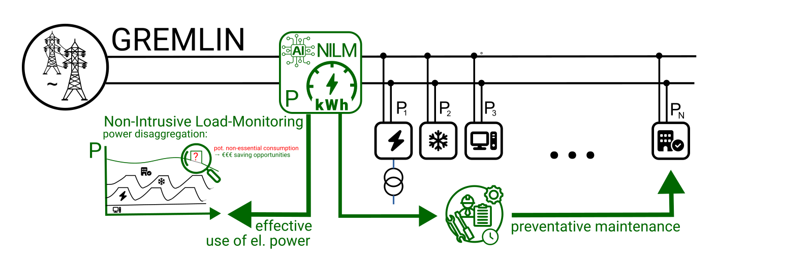
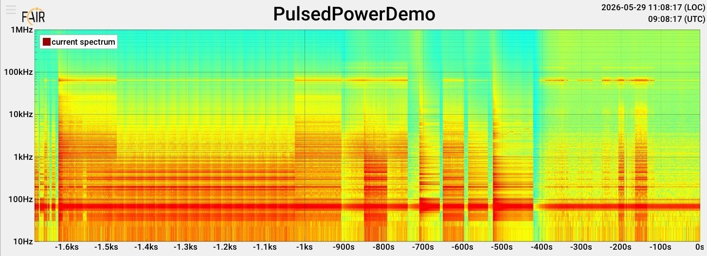

## GREMLIN — GReen Energy Monitoring for Large INfrastructure

<!-- DOI badge is a placeholder until the first Zenodo release. Replace with one of:
       static  : 
       dynamic : 
     REPOID is the numeric GitHub repo ID (Settings → General → Repository ID). -->

A non-intrusive, facility-scale diagnostic layer that turns the electromagnetic noise every electrical device emits into actionable
information — where energy is used, and which equipment is degrading — from a single or few high-bandwidth measurement points instead 
of per-device instrumentation.

<picture>
  <source media="(prefers-color-scheme: dark)" srcset="docs/img/GREMLIN_dark.png">
  
</picture>

## Motivation

Any modern accelerator or large scale infrastructure complex contains tens of thousands of individually-powered devices 
— magnet power converters, RF amplifiers, cryogenic plant, water cooling, beam diagnostics, IT infrastructure, and 
conventional facility loads — each with its own electrical signature and drift toward end-of-life. Instrumenting every 
device is neither economical nor sustainable, leaving both the operational energy footprint and the early signs of 
impending equipment failure largely invisible.

GREMLIN tackles both — per-device energy accounting *and* the small *gremlins* (drifts, harmonics, switching anomalies that precede hard
faults, enabling preventative maintenance scheduling) — through a single technical approach: software-defined-radio-grade signal
processing on the open-source [GNU Radio 4.0](https://github.com/fair-acc/gnuradio4) platform, applied to non-intrusive load monitoring.
The approach is sized for the operational energy footprint, availability, and life-cycle sustainability of FAIR- and FCC-scale infrastructure.

## How it works

Any switching electrical device emits a characteristic electromagnetic-interference (EMI) signature — switching frequencies, harmonics and transients that depend on the device type and its operating state.
Conducted EMI travels along the facility's mains wiring with low attenuation (a few dB per hundred metres), so a single high-bandwidth sensor at an upstream feed point sees many devices' signatures superimposed; because each is distinct, the superposition can be *disaggregated*.

GREMLIN couples this single-point sensing with non-intrusive load monitoring (NILM) and a learned classifier, *benchmarked against classical methods* on controlled ground truth — so results are cross-checked, not taken on trust.
It is a *diagnostic layer, not an energy controller*: it surfaces where action is warranted; operators and existing control systems decide and act.

For full documentation see: [https://fair-acc.github.io/gremlin/](https://fair-acc.github.io/gremlin/)

## What it provides

 - **Energy footprint** — disaggregate consumption to show where power actually goes, including non-essential loads and efficiency drift in ageing converters.
 - **Availability** — catch device degradation early for proactive, grouped maintenance instead of reactive, single-point-failure response.
 - **Unaccounted-for loads** — power drawn on the network that matches no known device signature.
 - **Grid / regulatory compliance** — stay within the network operator's emission and power tolerances.

> Quantified energy and cost benefits are an iRIS deliverable set by detection performance — projected mechanisms, **not yet measured values**.

## Ecosystem & Reproducibility

GREMLIN is developed as free / open hardware and software by GSI/FAIR; reproducibility and industrial or private applicability are explicit project goals. 
It builds on the FAIR-ACC open stack, with models exchanged in the portable **ONNX** format.

| Repository | Purpose |
| --- | --- |
| **gremlin** (this repo) | GREMLIN documentation, models, demonstrations |
| [pulsed-power-ml](https://github.com/fair-acc/pulsed-power-ml) | Pulsed-power PoC and electrical-network-compliance work |
| [gnuradio4](https://github.com/fair-acc/gnuradio4) | GNU Radio 4 signal-processing runtime (GR4) |
| [gr-digitizers](https://github.com/fair-acc/gr-digitizers) | DAQ / digitiser integration |
| [opendigitizer](https://github.com/fair-acc/opendigitizer) | UI / UX |

## License and Copyright

Unless otherwise noted: 
`SPDX-License-Identifier: LGPL-3.0-or-later WITH LGPL-3.0-linking-exception` & 
`SPDX-License-Identifier: CC-BY-SA-4.0`

Copyright © GSI Helmholtz Centre for Heavy Ion Research, Darmstadt, Germany 
Copyright © FAIR — Facility for Antiproton and Ion Research in Europe, Darmstadt, Germany

## Funding & Acknowledgements

<table class="eu-funding" border="1" cellpadding="12" cellspacing="0" style="background-color: #ffffff; color: #1a1a1a; border-color: #cccccc;">
  <tr>
    <td align="center" valign="middle" width="120" bgcolor="#ffffff" style="background-color: #ffffff;">
      
    </td>
    <td valign="middle" bgcolor="#ffffff" style="background-color: #ffffff; color: #1a1a1a;">
      This project has received funding from the European Union's Horizon
      Europe research and innovation programme under grant agreement
      No. <a href="https://ec.europa.eu/info/funding-tenders/opportunities/portal/screen/opportunities/projects-details/43108390/101275935/HORIZON" target="_blank" style="color: #003399;">101275935</a> (<a href="https://zenodo.org/communities/101275935/" target="_blank" style="color: #003399;">iRIS – Intelligent Research Infrastructure
      Sustainability</a>). Views and opinions expressed are however those of the author(s) only and do not necessarily reflect those of the European Union or the granting authority. Neither the European Union nor the granting authority can be held responsible for them.
    </td>
  </tr>
</table>

GREMLIN is developed at **GSI and FAIR**, Darmstadt, with contributions from iRIS partners. 
It builds on the [GNU Radio 4.0](https://github.com/fair-acc/gnuradio4) streaming signal-processing framework and reuses domain knowledge from [`fair-acc/pulsed-power-ml`](https://github.com/fair-acc/pulsed-power-ml).
