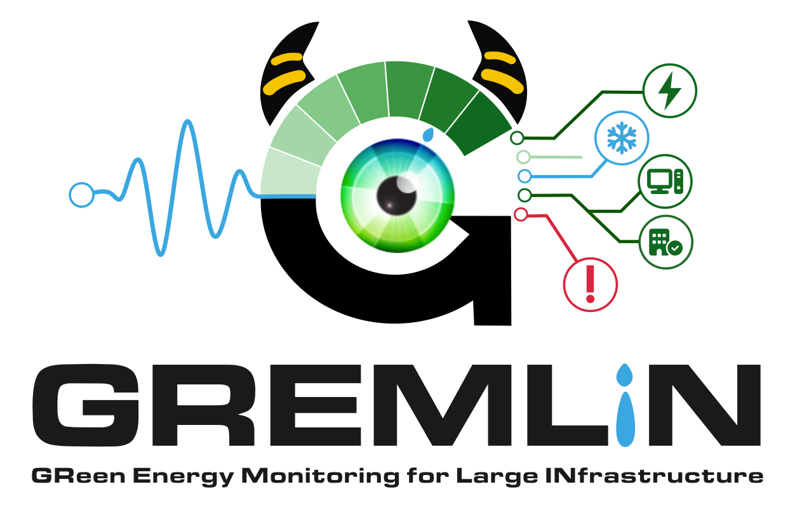
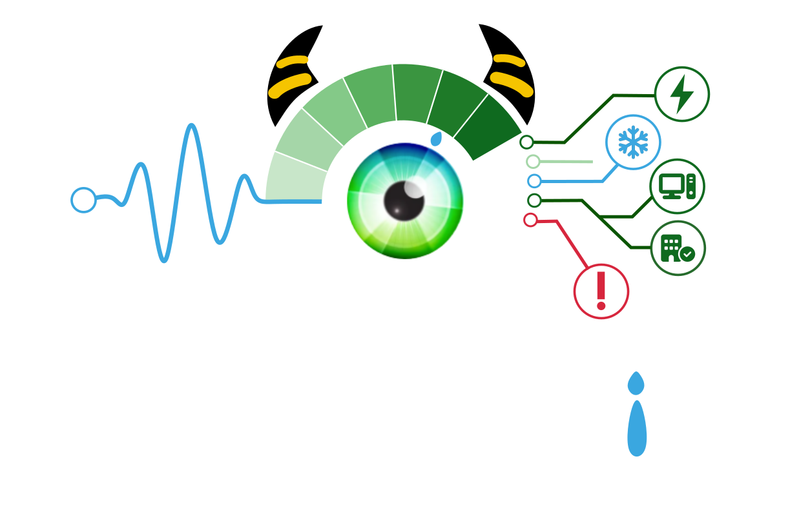
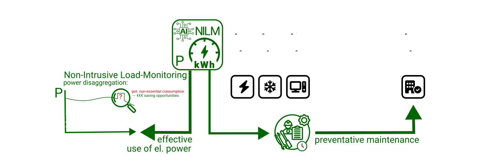

### GREMLIN - GReen Energy Monitoring for Large INfrastructure {: .visually-hidden }

A non-intrusive, facility-scale diagnostic layer that turns the electromagnetic noise every electrical device emits into actionable
information — where energy is used, and which equipment is degrading — from a few high-bandwidth measurement points instead of
per-device instrumentation.

From that one measurement, GREMLIN produces two operational outputs: a disaggregated, per-device picture of where the energy goes
(the *footprint* axis), and an early-warning layer that detects the slow drift of [EMI signatures as equipment ages](how-it-works.md#ageing-as-rf-signature) 
(the *availability* axis). Signal processing runs on [GNU Radio 4.0](https://github.com/fair-acc/gnuradio4) — already used operationally at GSI/FAIR 
— and machine-learning models are deployed through the framework-neutral **ONNX** exchange format. Models are benchmarked against 
well-understood classical spectral estimators, so any claimed gain is measured against a transparent baseline rather than asserted. 
As a by-product, GREMLIN also surfaces *unaccounted-for loads* — power drawn on the network that matches no known device signature. 
It builds directly on the published GSI proof-of-concept [`pulsed-power-ml`](https://github.com/fair-acc/pulsed-power-ml) 
and matures that work toward larger device counts under iRIS.

> **Status — research → engineering.** An engineered model is validated today at small scale (order tens of devices); iRIS funds
> maturing it toward **TRL 6–7** at larger device counts, under real-world conditions.

GREMLIN is a **diagnostic layer, not an energy controller**: it identifies where action is warranted; operators and existing control
systems decide and act.

**Further reading**:

- [How it works](how-it-works.md) — EMI signatures, disaggregation, NILM, and the classical-baseline benchmark.
- [What it provides](what-it-provides.md) — energy footprint, availability, unaccounted-for loads, and grid compliance.
- [References](references.md) — prior art, related projects, and citation.

## Ecosystem & Reproducibility

GREMLIN is developed as free / open hardware and software at GSI/FAIR; reproducibility is an explicit project goal. 
It builds on the FAIR-ACC open stack, with models exchanged in the portable **ONNX** format.

| Repository | Purpose |
| --- | --- |
| [gremlin](https://github.com/fair-acc/gremlin) (this repo) | Documentation, models, demonstrations |
| [pulsed-power-ml](https://github.com/fair-acc/pulsed-power-ml) | Pulsed-power PoC and electrical-network-compliance work |
| [gnuradio4](https://github.com/fair-acc/gnuradio4) | GNU Radio 4 signal-processing runtime (GR4) |
| [gr-digitizers](https://github.com/fair-acc/gr-digitizers) | DAQ / digitiser integration |
| [opendigitizer](https://github.com/fair-acc/opendigitizer) | UI / UX |

Related technologies: GNU Radio, ONNX, VictoriaMetrics (time-series DB, tbc).

## License and Copyright

Unless otherwise noted: 
`SPDX-License-Identifier: LGPL-3.0-or-later WITH LGPL-3.0-linking-exception` & 
`SPDX-License-Identifier: CC-BY-SA-4.0`

Copyright © GSI Helmholtz Centre for Heavy Ion Research, Darmstadt, Germany  
Copyright © FAIR — Facility for Antiproton and Ion Research in Europe, Darmstadt, Germany

## Funding & Acknowledgements

<table class="eu-funding" border="1" cellpadding="12" cellspacing="0" style="background-color: #ffffff; color: #1a1a1a; border-color: #cccccc;">
  <tr>
    <td align="center" valign="middle" width="120" bgcolor="#ffffff" style="background-color: #ffffff;">
      
    </td>
    <td valign="middle" bgcolor="#ffffff" style="background-color: #ffffff; color: #1a1a1a;">
      This project has received funding from the European Union's Horizon
      Europe research and innovation programme under grant agreement
      No. <a href="https://ec.europa.eu/info/funding-tenders/opportunities/portal/screen/opportunities/projects-details/43108390/101275935/HORIZON" target="_blank" style="color: #003399;">101275935</a> (<a href="https://zenodo.org/communities/101275935/" target="_blank" style="color: #003399;">iRIS – Intelligent Research Infrastructure
      Sustainability</a>). Views and opinions expressed are however those of the author(s) only and do not necessarily reflect those of the European Union or the granting authority. Neither the European Union nor the granting authority can be held responsible for them.
    </td>
  </tr>
</table>

GREMLIN is developed at **GSI and FAIR**, Darmstadt, with contributions from iRIS partners. It builds on the
[GNU Radio 4.0](https://github.com/fair-acc/gnuradio4) streaming signal-processing framework and reuses domain knowledge from
[`fair-acc/pulsed-power-ml`](https://github.com/fair-acc/pulsed-power-ml).
